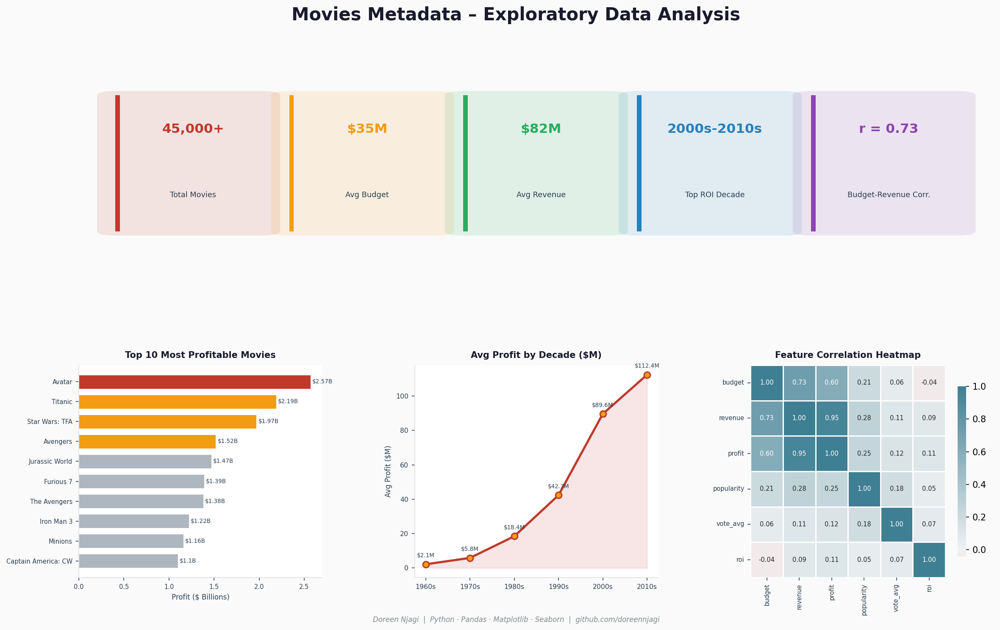

# Movies Metadata – Exploratory Data Analysis

A Python EDA project exploring **~45,000 movies** from the Kaggle Movies Metadata dataset, focusing on financial performance — budget, revenue, profit, and return on investment (ROI) — and what makes a film commercially successful.

---

## 📌 Project Overview

| | |
|--|--|
| **Objective** | Analyze financial trends and uncover what drives movie profitability |
| **Dataset** | Kaggle – Movies Metadata (~45,000 movies) |
| **Key Metrics** | Budget, Revenue, Profit, ROI, Popularity, Vote Average |
| **Tools** | Python, Pandas, Matplotlib, Seaborn, NumPy |

---

## 📂 Dataset

- **Source**: Kaggle – [Movies Metadata](https://www.kaggle.com/datasets)
- **Shape**: ~45,000 movies, multiple features
- **Key Columns used**:
  - `title` – Movie name
  - `release_date` – Release year
  - `budget` – Production budget
  - `revenue` – Box office revenue
  - `popularity`, `vote_average`, `vote_count` – Audience engagement metrics

---

## ⚙️ Data Preparation

1. Loaded dataset with `low_memory=False` to avoid type-inference issues in Pandas
2. Converted financial columns (`budget`, `revenue`, `popularity`, `vote_average`, `vote_count`) to numeric
3. Engineered new features:
   - `profit = revenue – budget`
   - `roi = profit / budget` (return on investment)
   - `year` and `decade` extracted from `release_date`
4. Handled missing values by coercing invalid entries into `NaN`

---

## 📊 Exploratory Data Analysis

### 1. Overall Distribution
- Most movies have low budgets and low revenues
- A few blockbusters (Avatar, Titanic) dominate the distribution

### 2. Profitability Over Time
- Calculated average profit by decade
- The **2000s–2010s** were the most profitable decades in Hollywood

### 3. Top 10 Most Profitable Movies
- Avatar, Titanic, and Star Wars: TFA rank highest in absolute profit
- Visualized using horizontal bar charts

### 4. Correlation Analysis
- Strong correlation between **budget and revenue** (r = 0.73)
- ROI has weaker correlation with budget → high budget ≠ high return

### 5. Outlier Handling
- Filtered extreme outliers for cleaner scatterplots
- Clean scatter showed a clear positive trend: higher budgets generally yield higher revenues

---

## 📌 Key Insights

1. Most movies don't generate massive profits — only a few blockbusters skew the data
2. Budget and revenue are strongly correlated (r = 0.73)
3. The 2000s–2010s were the most financially successful decades
4. High budget does not guarantee high ROI — smaller films sometimes achieve better returns

---

## 📁 Files

| File | Description |
|------|-------------|
| `movies-metadata-analysis.ipynb` | Full EDA notebook |
| `movies_metadata.csv` | Dataset |
| `movies_metadata_dashboard.png` | Analysis dashboard |

---

## 🛠️ Tools & Libraries

| Tool | Purpose |
|------|---------|
| **Python 3** | Core language |
| **Pandas** | Data cleaning and feature engineering |
| **Matplotlib / Seaborn** | Visualization |
| **NumPy** | Numeric operations |

---

## 👤 About Me

Hi, I'm **Doreen Njagi** — a Data Analyst with a background in Mathematics and Computer Science, based in Nairobi, Kenya 🇰🇪.

I specialize in SQL, Python, Excel, Power BI, and Tableau — turning raw data into clear, actionable insights.

- 📫 [LinkedIn](https://www.linkedin.com/in/doreen-njagi-196350389/)
- 🌐 [Portfolio](https://doreennjagi.github.io/reen-data-portfolio)
- 🐙 [GitHub](https://github.com/doreennjagi)

## 📸 Sample Visualizations
> Charts and plots are available inside the notebook.

## 🚀 How to Run
1. Clone this repo
2. Install dependencies: `pip install -r requirements.txt`
3. Open `movies-metadata-analysis.ipynb` in Jupyter
4. Run all cells top to bottom
